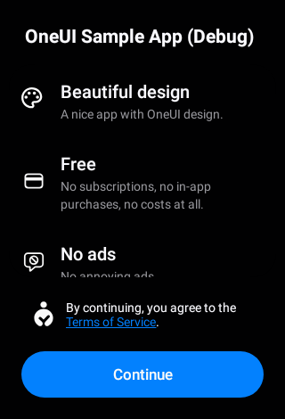
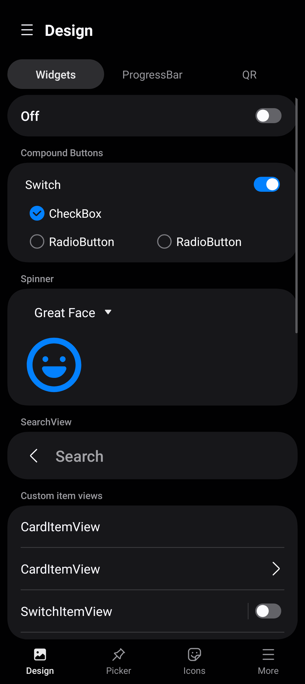
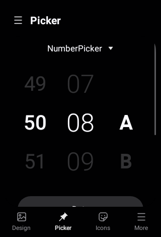
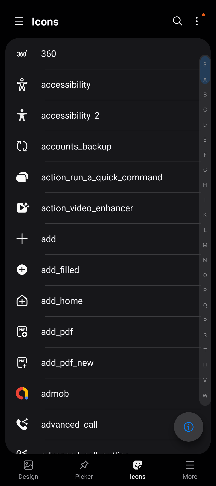
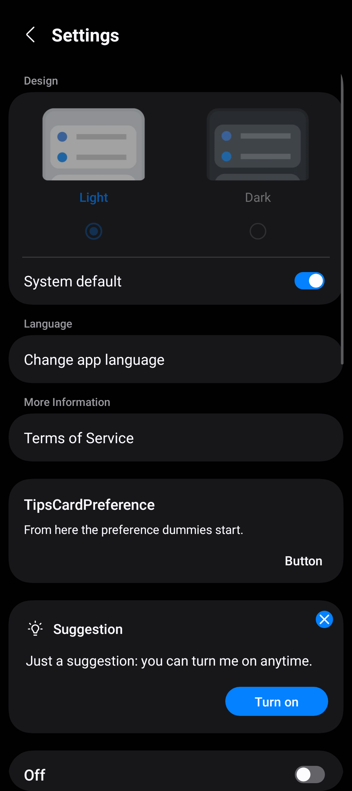

<!--suppress HtmlDeprecatedAttribute CheckImageSize-->

# OneUI Sample App

This is a sample app for the <a href="https://github.com/tribalfs/oneui-design">OneUI-Design lib</a>.

 

<h3>
<a href="https://github.com/Lemkinator/OneUI-Sample-App/raw/main/app/release/app-release.apk">Download SampleAPK</a>
</h3>

  

## Stats

 

## Code Coverage

 

<picture>
    <!--suppress HtmlUnknownTarget -->
    <source media="(prefers-color-scheme: dark)" srcset="https://api.star-history.com/svg?repos=Lemkinator/OneUI-Sample-App&type=Date&theme=dark" />
    
</picture>

