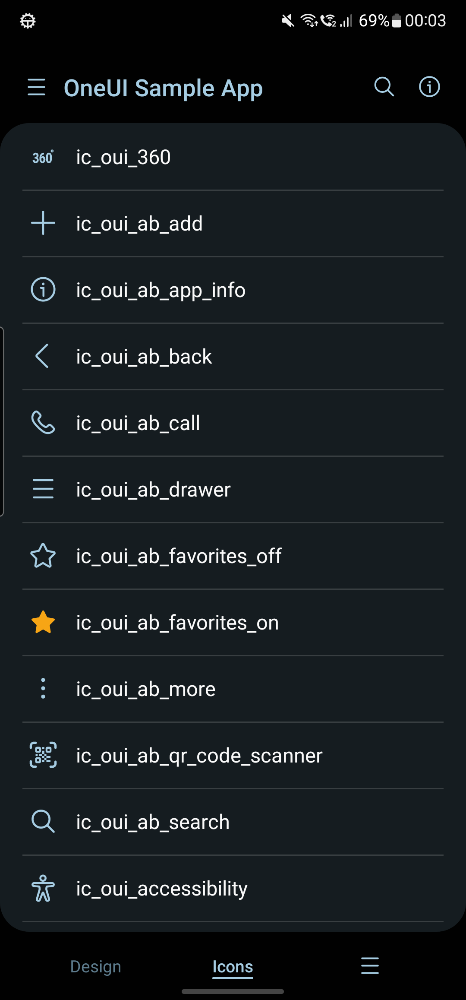

  

  

  
  
  # OneUI Sample App
  This is a sample app for the <a href="https://github.com/OneUIProject">OneUI libraries</a>.
  While the <a href="https://github.com/OneUIProject/oneui-design#oneui-sample-app">sample app in java</a> is rather meant to test the library, this app rather shows the implementation from the user's point of view.
  
  
  
  
  

  <h3 align="center"><a href="https://github.com/Lemkinator/OneUI-Sample-App/raw/master/app/release/app-release.apk">Download Sample APK</a></h3>

     
  
  ### Stargazers over time

  
  

